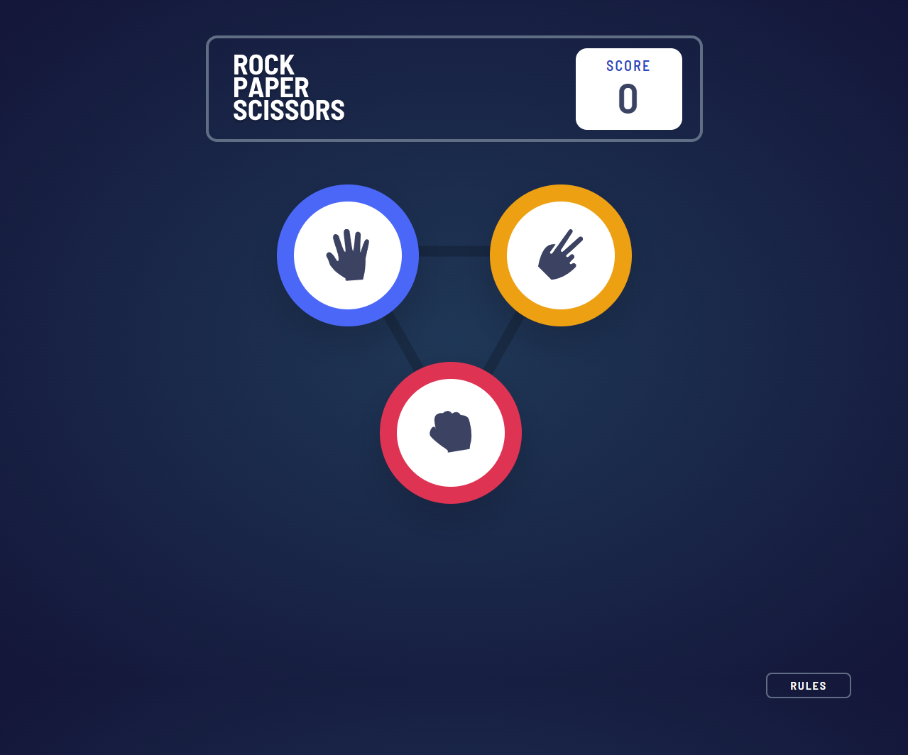

# Frontend Mentor - Rock, Paper, Scissors solution

This is a solution to the [Rock, Paper, Scissors challenge on Frontend Mentor](https://www.frontendmentor.io/challenges/rock-paper-scissors-game-pTgwgvgH). Frontend Mentor challenges help you improve your coding skills by building realistic projects.

## Table of contents

- [Overview](#overview)
  - [The challenge](#the-challenge)
  - [Screenshot](#screenshot)
- [My process](#my-process)
  - [Built with](#built-with)
  - [What I learned](#what-i-learned)
  - [Continued development](#continued-development)
- [Author](#author)
- [Acknowledgments](#acknowledgments)

## Overview

### The challenge

Users should be able to:

- View the optimal layout for the game depending on their device's screen size
- Play Rock, Paper, Scissors against the computer
- Maintain the state of the score after refreshing the browser _(optional)_
- **Bonus**: Play Rock, Paper, Scissors, Lizard, Spock against the computer _(optional)_

### Screenshot

### Links

- Solution URL: [Add solution URL here](https://your-solution-url.com)
- Live Site URL: [Add live site URL here](https://cbuntrakulsuk.github.io/RPS-Game)

## My process

### Built with

- Semantic HTML5 markup
- CSS custom properties
- Flexbox
- [React](https://reactjs.org/) - JS library
- [Tailwindcss](https://tailwindcss.com/)
- [Vitejs](https://vitejs.dev/)

**Note: These are just examples. Delete this note and replace the list above with your own choices**

### What I learned

In my third React.js project, I embarked on a journey with TypeScript for the first time, and it enriched my understanding of several crucial aspects of web development. I delved deeper into the intricacies of passing functions as props, efficiently managing state within components, and mastering the art of conditional rendering. For styling, I harnessed the power of Tailwind CSS, elevating the aesthetics of my project. As I reflect on this endeavor,

### Continued development

I am enthusiastic about taking on the bonus sections to expand the game to include Rock, Paper, Scissors, Lizard, and Spock, as well as implementing a persistent scoreboard state that survives browser refreshes. These enhancements are poised to elevate the excitement and educational value of this already exhilarating gaming experience.

## Author

- Website - [Chad Buntrakulsuk](https://github.com/cbuntrakulsuk)
- Frontend Mentor - [@cbuntrakulsuk](https://www.frontendmentor.io/profile/cbuntrakulsuk)
